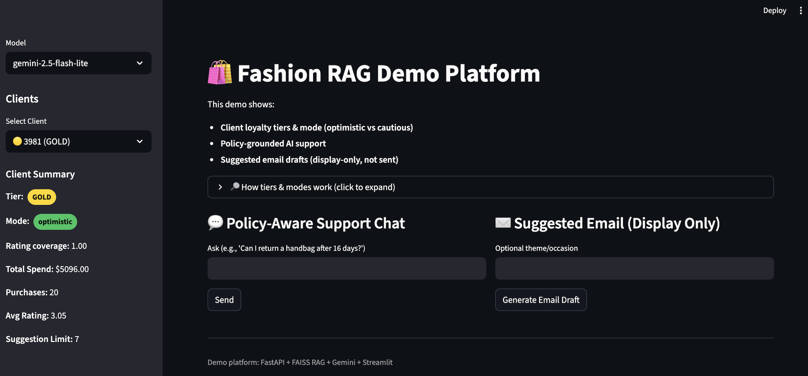
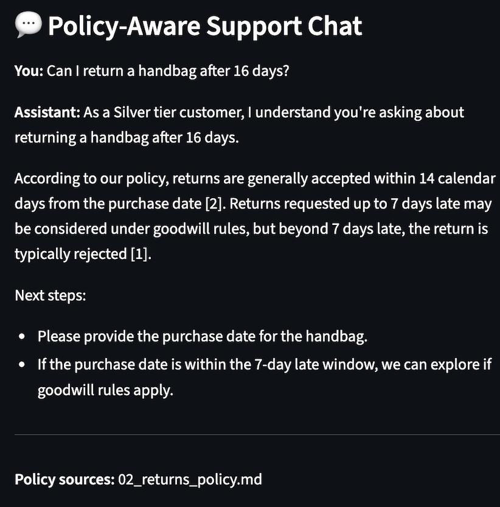
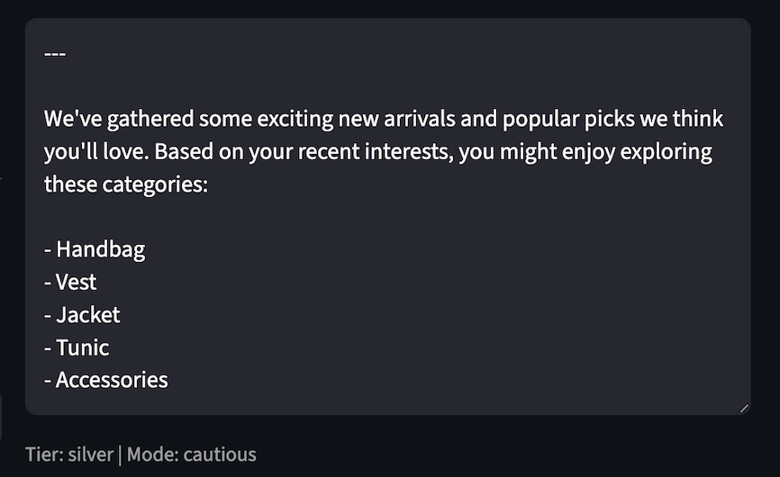

# Fashion RAG Platform

Policy-aware support + loyalty-aware recommendations using **FastAPI + FAISS (RAG) + Gemini + Streamlit**.

---

## What It Does

- Classifies customers into **tiers** (Bronze / Silver / Gold / VIP)  
- Detects interaction **mode** (optimistic vs. cautious)  
- Answers policy questions grounded in internal docs (RAG)  
- Generates **email suggestions** using client purchase history (display-only)  

---

## Quick Examples

### 1) RetailOps_AI



---


---


### 2) Policy-Aware Support & Suggested Email Draft Example (RAG + Gemini)


<p align="center">
  
  
</p>

---

## Repository Contents

### Dataset
- `fashion_data/Fashion_Retail_Sales.csv`  
  Public retail transactions dataset used to simulate customer purchase history and ratings.

### Policy Documents (RAG Source)
- `docs/`  
  Markdown policy docs (returns, refunds, loyalty, support) ingested into FAISS.

### RAG Index (Generated)
- `dat/out/`  
  Generated FAISS index + metadata (not committed). Build locally using:

  ```bash
  python -m rag.ingest
  ```

---

## How to Run Locally

### Install

```bash
python -m venv env
source env/bin/activate
pip install -r requirements.txt
```

### Configure Gemini

Add `GEMINI_API_KEY` inside:

```
src/.env
```

### Build RAG Index

```bash
python -m rag.ingest
```

### Start Backend

```bash
uvicorn src.app:app --reload --port 8000
```

### Start Frontend (New Terminal)

```bash
streamlit run ui/streamlit_app.py
```

### Open in Browser

```
http://localhost:8501
```


